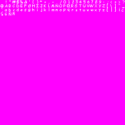
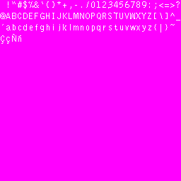

NightFox’s Lib for LibNDS.
Reference manual.
Version 20120318
http://www.nightfoxandco.com
http://www.nightfoxandco.com/forum
contact@nightfoxandco.com

---

- [How to install](#how-to-install)
- [#include <nf_lib.h>](#include-nf_libh)
  - [NF_Error](#nf_error)
  - [NF_SetRootFolder](#nf_setrootfolder)
  - [NF_DmaMemCopy](#nf_dmamemcopy)
  - [NF_GetLanguage](#nf_getlanguage)
- [#include “nf_2d.h”](#include-nf_2dh)
  - [NF_Set2D](#nf_set2d)
  - [NF_ShowBg](#nf_showbg)
  - [NF_HideBg](#nf_hidebg)
  - [NF_ScrollBg](#nf_scrollbg)
  - [NF_MoveSprite](#nf_movesprite)
  - [NF_SpriteLayer](#nf_spritelayer)
  - [NF_ShowSprite](#nf_showsprite)
  - [NF_HflipSprite](#nf_hflipsprite)
  - [NF_GetSpriteHflip](#nf_getspritehflip)
  - [NF_VflipSprite](#nf_vflipsprite)
  - [NF_GetSpriteVflip](#nf_getspritevflip)
  - [NF_SpriteFrame](#nf_spriteframe)
  - [NF_EnableSpriteRotScale](#nf_enablespriterotscale)
  - [NF_DisableSpriteRotScale](#nf_disablespriterotscale)
  - [NF_SpriteRotScale](#nf_spriterotscale)
- [#include “nf_tiledbg.h”](#include-nf_tiledbgh)
  - [NF_InitTiledBgBuffers](#nf_inittiledbgbuffers)
  - [NF_ResetTiledBgBuffers](#nf_resettiledbgbuffers)
  - [NF_InitTiledBgSYs](#nf_inittiledbgsys)
  - [NF_LoadTiledBg](#nf_loadtiledbg)
  - [NF_UnloadTiledBg](#nf_unloadtiledbg)
  - [NF_CreateTiledBg](#nf_createtiledbg)
  - [NF_DeleteTiledBg](#nf_deletetiledbg)
  - [NF_LoadTilesForBg](#nf_loadtilesforbg)
  - [NF_GetTileOfMap](#nf_gettileofmap)
  - [NF_SetTileOfMap](#nf_settileofmap)
  - [NF_UpdateVramMap](#nf_updatevrammap)
  - [NF_BgSetPalColor](#nf_bgsetpalcolor)
  - [NF_BgEditPalColor](#nf_bgeditpalcolor)
  - [NF_BgUpdatePalette](#nf_bgupdatepalette)
  - [NF_Bg_GetPal_Color](#nf_bg_getpal_color)
  - [NF_GetTilePal](#nf_gettilepal)
  - [NF_SetTilePal](#nf_settilepal)
  - [NF_LoadExBgPal](#nf_loadexbgpal)
  - [NF_UnloadExBgPal](#nf_unloadexbgpal)
  - [NF_VramExBgPal](#nf_vramexbgpal)
  - [NF_SetExBgPal](#nf_setexbgpal)
  - [NF_SetTileHflip](#nf_settilehflip)
  - [NF_SetTileVflip](#nf_settilevflip)
  - [NF_RoatteTilfeGfx](#nf_roattetilfegfx)
- [#include “nf_sprite256.h”](#include-nf_sprite256h)
  - [NF_InitSpriteBuffers](#nf_initspritebuffers)
  - [NF_ResetSpriteBuffers](#nf_resetspritebuffers)
  - [NF_InitSpriteSys](#nf_initspritesys)
  - [NF_LoadSpriteGfx](#nf_loadspritegfx)
  - [NF_UnloadSpriteGfx](#nf_unloadspritegfx)
  - [NF_LoadSpritePal](#nf_loadspritepal)
  - [NF_UnloadSpritePal](#nf_unloadspritepal)
  - [NF_VramSpriteGfx](#nf_vramspritegfx)
  - [NF_FreeSpriteGfx](#nf_freespritegfx)
  - [NF_VramSpriteGfxDefrag](#nf_vramspritegfxdefrag)
  - [NF_VramSpritePal](#nf_vramspritepal)
  - [NF_CreateSprite](#nf_createsprite)
  - [NF_DeleteSprite](#nf_deletesprite)
  - [NF_SpriteOamSet](#nf_spriteoamset)
  - [NF_SpriteSetPalColor](#nf_spritesetpalcolor)
  - [NF_SpriteEditPalColor](#nf_spriteeditpalcolor)
  - [NF_SpriteUpdatePalette](#nf_spriteupdatepalette)
  - [NF_SpriteGetPalColor](#nf_spritegetpalcolor)
- [#include “nf_text.h”](#include-nf_texth)
  - [NF_InitTextSys](#nf_inittextsys)
  - [NF_LoadTextFont](#nf_loadtextfont)
  - [NF_UnloadTextFont](#nf_unloadtextfont)
  - [NF_CreateTextLayer](#nf_createtextlayer)
  - [NF_DeleteTextLayer](#nf_deletetextlayer)
  - [NF_WriteText](#nf_writetext)
  - [NF_UpdateTextLayers](#nf_updatetextlayers)
  - [NF_ClearTextLayer](#nf_cleartextlayer)
  - [NF_DefineTextColor](#nf_definetextcolor)
  - [NF_SetTextColor](#nf_settextcolor)
- [#include “nf_text16.h”](#include-nf_text16h)
  - [NF_LoadTextFont16](#nf_loadtextfont16)
  - [NF_CreateTextLayer16](#nf_createtextlayer16)
  - [NF_WriteText16](#nf_writetext16)
  - [NF_ClearTextLayer16](#nf_cleartextlayer16)
- [#include “nf_colision.h”](#include-nf_colisionh)
  - [NF_InitCmapBuffers](#nf_initcmapbuffers)
  - [NF_ResetCmapBuffers](#nf_resetcmapbuffers)
  - [NF_LoadColisionMap](#nf_loadcolisionmap)
  - [NF_UnloadColisionMap](#nf_unloadcolisionmap)
  - [NF_GetTile](#nf_gettile)
  - [NF_SetTile](#nf_settile)
  - [NF_LoadColisionBg](#nf_loadcolisionbg)
  - [NF_GetPoint](#nf_getpoint)
- [#include “nf_sound.h”](#include-nf_soundh)
  - [NF_InitRawSoundBuffers](#nf_initrawsoundbuffers)
  - [NF_ResetRawSoundBuffers](#nf_resetrawsoundbuffers)
  - [NF_LoadRawSound](#nf_loadrawsound)
  - [NF_UnloadRawSoundd](#nf_unloadrawsoundd)
  - [NF_PlayRawSound](#nf_playrawsound)
- [#include “nf_bitmapbg.h”](#include-nf_bitmapbgh)
  - [NF_Init16bitsBgBuffers](#nf_init16bitsbgbuffers)
  - [NF_Reset16bitsBgBuffers](#nf_reset16bitsbgbuffers)
  - [NF_Init16bitsBackBuffer](#nf_init16bitsbackbuffer)
  - [NF_Enable16bitsBackBuffer](#nf_enable16bitsbackbuffer)
  - [NF_Disable16bitsBackBuffer](#nf_disable16bitsbackbuffer)
  - [NF_Flip16bitsBackBuffer](#nf_flip16bitsbackbuffer)
  - [NF_InitBitmapBgSys](#nf_initbitmapbgsys)
  - [NF_Load16bitsBg](#nf_load16bitsbg)
  - [NF_Unload16bitBg](#nf_unload16bitbg)
  - [NF_Copy16bitsBuffer](#nf_copy16bitsbuffer)
  - [NF_Init8bitsBgBuffers](#nf_init8bitsbgbuffers)
  - [NF_Reset8bitsBgBuffers](#nf_reset8bitsbgbuffers)
  - [NF_Load8bitBg](#nf_load8bitbg)
  - [NF_Unload8bitsBg](#nf_unload8bitsbg)
  - [NF_Copy8bitsBuffer](#nf_copy8bitsbuffer)
  - [NF_Init8bitsBackBuffer](#nf_init8bitsbackbuffer)
  - [NF_Enable8bitsBackBuffer](#nf_enable8bitsbackbuffer)
  - [NF_Disable8bitsBackBuffer](#nf_disable8bitsbackbuffer)
  - [NF_Flip8bitsBackBuffer](#nf_flip8bitsbackbuffer)
  - [NF_Load16bitsImage](#nf_load16bitsimage)
  - [NF_Draw16bitsImage](#nf_draw16bitsimage)
- [#include “nf_media.h”](#include-nf_mediah)
  - [NF_LoadBMP](#nf_loadbmp)
- [#include “nf_affine.h”](#include-nf_affineh)
  - [NF_InitAffineBgSys](#nf_initaffinebgsys)
  - [NF_LoadAffineBg](#nf_loadaffinebg)
  - [NF_UnloadAffineBg](#nf_unloadaffinebg)
  - [NF_CreateAffineBg](#nf_createaffinebg)
  - [NF_DeleteAffineBg](#nf_deleteaffinebg)
  - [NF_AffineBgTransform](#nf_affinebgtransform)
  - [NF_AffineBgMove](#nf_affinebgmove)
  - [NF_AffineBgCenter](#nf_affinebgcenter)
- [#include “nf_3d.h”](#include-nf_3dh)
  - [NF_InitOpenGl](#nf_initopengl)
- [#include “nf_sprite3d.h”](#include-nf_sprite3dh)
  - [NF_Init3dSpriteSys](#nf_init3dspritesys)
  - [NF_Vram3dSpriteGfx](#nf_vram3dspritegfx)
  - [NF_Free3dSpriteGfx](#nf_free3dspritegfx)
  - [NF_VramSpriteGfxDefrag](#nf_vramspritegfxdefrag-1)
  - [NF_Vram3dSpritePal](#nf_vram3dspritepal)
  - [NF_Create3dSprite](#nf_create3dsprite)
  - [NF_Delete3dSprite](#nf_delete3dsprite)
  - [NF_Sort3dSprites](#nf_sort3dsprites)
  - [NF_Set3dSpritePriority](#nf_set3dspritepriority)
  - [NF_Swap3dSpritePriority](#nf_swap3dspritepriority)
  - [NF_Move3dSprite](#nf_move3dsprite)
  - [NF_Show3dSprite](#nf_show3dsprite)
  - [NF_Set3dSpriteFrame](#nf_set3dspriteframe)
  - [NF_Draw3dSprites](#nf_draw3dsprites)
  - [NF_Update3dSpriteGfx](#nf_update3dspritegfx)
  - [NF_Rotate3dSprite](#nf_rotate3dsprite)
  - [NF_Scale3dSprite](#nf_scale3dsprite)
  - [NF_Blend3dSprite](#nf_blend3dsprite)
  - [NF_3dSpritesLayer](#nf_3dspriteslayer)
  - [NF_3dSpriteEditPalColor](#nf_3dspriteeditpalcolor)
  - [NF_3dSpriteUpdatePalette](#nf_3dspriteupdatepalette)
  - [NF_3dSpriteGetPalColor](#nf_3dspritegetpalcolor)
  - [NF_3dSpriteSetDeep](#nf_3dspritesetdeep)
- [#include “nf_mixedbg.h”](#include-nf_mixedbgh)
  - [NF_InitMixedBgSys](#nf_initmixedbgsys)

---
# How to install
Copy the NFLIB folder in the root of your project folder. To use it, just put in your code. Copy also to the root folder of your project the files “makefile” and “icon.bmp”. You must modify those files to adapt them to your project.#include “nf_basic.h”


# #include <nf_lib.h>

## NF_Error
```c++
void NF_Error( 
    u16 code,         // Error code
    const char* text, // Description
    u32 value         // Additional info
);
```
Generates an error and stops program execution, showing on the screen the error. This command it’s internaly used by the lib to generate debug messages and rarely will be used in you code.

**Example:**
```c++
NF_Error(112, “Sprite”, 37);
```
Generates a error with code 112, with the text “sprite” as description and a value of 37.

**Error Codes**
* 101: File not found
* 102: Out of memory
* 103: There are no free slots
* 104: Background not found
* 105: Background not created
* 106: Out of range
* 107: Insufficient contiguous blocks in VRAM (Tiles)
* 108: Insufficient contiguous blocks in VRAM (Maps)
* 109: Id busy (already in use)
* 110: Id not loaded (in RAM)
* 111: Id not in VRAM
* 112: Sprite not created
* 113: Insufficient VRAM memory
* 114: Text layer does not exist
* 115: Unsupported background measurements (not multiples of 256)
* 116: File too large
* 117: Incorrect affine fund measurements
* 118: Wrong affine background creation layer

## NF_SetRootFolder
```c++
void NF_SetRootFolder( 
    const char* folder // Name of your root folder
);
```

Defines the root folder of your project then inits the filesystem (FAT or NitroFS). This makes easy change the name of folder that contains all files of your project after it’s compiled. It’s imperative the use of this function before load any file from FAT. If you want to use NitroFS, use “NITROFS” as root folder name. You must copy the right MAKEFILE on the root of your project to enable NitroFS usage. Also you has to put all files you want to load in “nitrofiles” folder.

**Example:**
```c++
NF_SetRootFolder(“mygame”);
```
Define “mygame” folder as root for your project, using FAT. If you flashcard don’t supports ARGV, use Homebrew Menu to launch the ROM.

## NF_DmaMemCopy
```c++
void NF_DmaMemCopy(
void* destination,  // Destination pointer
const void* source, // Source pointer
u32 size            // Number of bytes to copy
);
```
Function to fast copy blocks of memory from RAM to VRAM (because it’s the kind of copy where DMA copy it’s most effective). The function checks if data it’s aligned for DMA copy, if not, uses memcpy(); command insead.

**Example:**
```c++
NF_DmaMemCopy((void*)0x06000000, buffer, 131072);
```
Copy to 0x06000000 memory adress of VRAM (Bank A), 131072 bytes of memory (128kb) from “buffer” pointer on RAM.

## NF_GetLanguage
```c++
u8 NF_GetLanguage(void);
```
Returns the user language ID.
* 0 Japanese
* 1 English
* 2 French
* 3 German
* 4 Italian
* 5 Spanish
* 6 Chinese

# #include “nf_2d.h”
## NF_Set2D
```c++
void NF_Set2D( 
    u8 screen,  // Screen (0 – 1)
    u8 mode     // Mode (0, 2, 5)
);
```
Init 2D mode for the selected screen.

**Mode**
* 0
* 2
* 5

**Configuration**
* Tiled Bg’s at 256 colors.
* Affine Bg’s of 8 bits in layers 2 & 3
* Bitmap Bg’s at 8 or 16 bits.

**Example:**
```c++
NF_Set2D(1, 0);
Init 2D mode for Tiled Bg’s and Sprites on screen 1 (bottom)
```

## NF_ShowBg
```c++
void NF_ShowBg(
    u8 screen,      // Screen (0 – 1)
    u8 layer        // Layer (0 – 3)
);
```
Makes visible the bg of layer & screen selected. Use this command to make visible a bg previus hide with NF_HideBg();

**Example:**
```c++
NF_ShowBg(0, 2);
```
Makes visible the bg of layer 2 in screen 0 (top)

## NF_HideBg
```c++
void NF_HideBg(
    u8 screen,  // Screen (0 – 1)
    u8 layer    // Layer (0 – 3)
);
```
Hides, without delete, the bg of layer & screen selected.

**Example:**
```c++
NF_HideBg(0, 2);
```
Makes invisible the bg of layer 2 in screen 0.

## NF_ScrollBg
```c++
void NF_ScrollBg(
    u8 screen,  //Screen (0 – 1)
    u8 layer,   //Layer (0 – 3)
    s16 x,      //Position X
    s16 y       //Position Y
);
```
Moves to the coordinates the bg of layer & screen selected.

**Example:**

```c++
NF_ScrollBg(0, 1, 128, 96);
```
Moves the bg of layer 1 and screen 0 to the coordinates x:128, y:96

## NF_MoveSprite
```c++
void NF_MoveSprite(
    u8 screen,  //Screen (0 – 1)
    u8 id,      //Id. of Sprite (0 – 127)
    s16 x,      //Position X
    s16 y       //Position Y
);
```
Move a sprite to the position specified.

**Example:**
```c++
NF_MoveSprite(0, 35, 100, 50);
```
Moves the sprite no35 of screen 0 to the coordinates x:100, y:50

## NF_SpriteLayer
```c++
void NF_SpriteLayer(
    u8 screen,  // Screen (0 – 1)
    u8 id,      // Id. of Sprite (0 – 127)
    u8 layer    // Layer (0 – 3)
);
```
Selects the layer where a Sprite will be draw. Layer 0 is the higher one and layer 3 the lower.

**Example:**
```c++
NF_SpriteLayer(1, 35, 2);
```
The Sprite no35 of screen 1 will be draw over layer no2.

## NF_ShowSprite
```c++
void NF_ShowSprite(
    u8 screen,  // Screen (0 – 1)
    u8 id,      // Id. of Sprite (0 – 127)
    bool show   // Visivility
);
```
Show or hides a Sprite. If you hide it, sprite just becomes invisible, without delete it.

**Example:**
```c++
NF_ShowSprite(0,35, false);
```
Hides the sprite no35 on screen 0.

```c++
NF_ShowSprite(1, 45, true);
```
Makes visible the Sprite no45 on screen 1.
## NF_HflipSprite
```c++
void NF_HflipSprite(
    u8 screen,  // Screen (0 – 1)
    u8 id,      // Id. of Sprite (0 – 127)
    bool hflip  // Horizontal flip
);
```
Changes the state of horizontaly flip of a Sprite.

**Example:**
```c++
NF_HflipSprite(0, 35, true);
```
Flips horizontaly the sprite no35 of screen 0.

## NF_GetSpriteHflip
```c++
bool NF_GetSpriteHflip(
    u8 screen,  // Screen (0 – 1)
    u8 id       // Id. of Sprite (0 – 127)
);
```
Get’s the state of horizontal flip of sprite.

**Example:**
```c++
state = NF_GetSpriteHflip(0, 35);
```
Stores on “state” variable if sprite no35 of screen 0 it’s flipped or not.

## NF_VflipSprite
```c++
void NF_VflipSprite(
    u8 screen,  // Screen (0 – 1)
    u8 id,      // Id. of Sprite (0 – 127)
    bool vflip  // Vertical Flip
);
```
Changes the state of vertical flip of sprite.

**Example:**
```c++
NF_VflipSprite(0, 35, true);
```
Flips verticaly the sprite no35 on screen 0.

## NF_GetSpriteVflip
```c++
bool NF_GetSpriteVflip(
    u8 screen,  // Screen (0 – 1)
    u8 id       // Id. of Sprite (0 – 127)
);
```
Get’s the state of vertical flip of sprite.

**Example:**
```c++
state = NF_GetSpriteVflip(0, 35);
```
Stores on “state” variable the state of vertical flip of sprite no35 on screen 0.

## NF_SpriteFrame
```c++
void NF_SpriteFrame(
    u8 screen,      // Screen (0 – 1)
    u8 id,          // Id. of Sprite (0 – 127)
    u8 frame        // Frame
);
```
Selects what frame of an animation has to show the sprite.
**Example**
```c++
NF_SpriteFrame(0, 20, 5);
```
Sprite no20 of screen 0 shows the frame no5.

## NF_EnableSpriteRotScale
```c++
void NF_EnableSpriteRotScale( 
    u8 screen,      //Screen (0 – 1)
    u8 sprite,      //Id. of Sprite (0 – 127)
    u8 id,          //RotSet to use (0 – 31)
    bool doublesize //Enable doublesize?
);
```
Makes a Sprite available to be rotated & scaled. You must specify what rotset of 32 availables will use the sprite. Various sprites can share the same rotset. If “doublesize” is disabled, the max size for sprites be 32x32, otherwise sprite will be clipped. If you enable the RotScale for sprite, flip states will be ignored.

**Example:**
```c++
NF_EnableSpriteRotScale(1, 111, 12, false);
```
Enables the Rotation & Scalation for sprite no111 on screen 1, using the RotSet no12, with “doublesize” disabled.

## NF_DisableSpriteRotScale
```c++
void NF_DisableSpriteRotScale(
    u8 screen,      // Screen (0 – 1)
    u8 sprite       // Id. of Sprite (0 – 127)
);
```
Disables the rotation & scalation of sprite.

**Example:**
```c++
NF_DisableSpriteRotScale(0, 46);
```
Disable rotation & scalation of sprite no46 of screen 0.

## NF_SpriteRotScale
```c++
void NF_SpriteRotScale(
    u8 screen, //Screen (0 – 1)
    u8 id, //RotSet number (0 – 31)
    s16 angle, //Angle (-512 a 512)
    u16 sx, //Scale X (0 a 512) 100% = 256
    u16 sy //Scale Y (0 a 512) 100% = 256
);
```
Setup the rotation & scalation values of a RotSet. All sprites asinged to this RotSet will rotate and scale using those values. Rotation angles is in 512 base. This mean the rotation will go from -512 to 512 (-360o to 360o). Scale values goes from 0 to 512. The 100% scale will be 256 value.

**Example:**
```c++
NF_SpriteRotScale(0, 16, 128, 256, 256);
```
Rotate 90o to the right all Sprites with the RotSet no16 asigned, with 100% scale in both directions, on screen 0.
```c++
NF_SpriteRotScale(1, 10, -256, 512, 256);
```
Rotate 180o to the left all Sprites with the RotSet no10 asigned, scaling the X size 200% and 100% the Y size, on screen 1.

# #include “nf_tiledbg.h”

## NF_InitTiledBgBuffers
```c++
void NF_InitTiledBgBuffers(void);
```
Init all buffers and variables to can load files from FAT to create Tiled Bg’s later. Use this function one time before load any bg from FAT.

**Example:**
```c++
NF_InitTiledBgBuffers();
```
Init buffers and variables to load tiled bg’s.

## NF_ResetTiledBgBuffers
```c++
void NF_ResetTiledBgBuffers(void);
```
Reset all buffers & variables for tiled bg’s load from FAT. This function empty all buffers in use and reset variable values to default. It’s usefull do this when you change a level in a game, to clean all stuff from RAM and make free space to load the new one.

**Example:**
```c++
NF_ResetTiledBgBuffers();
```
Empty all buffers and reset variable values.

## NF_InitTiledBgSYs
```c++
void NF_InitTiledBgSys(
    u8 screen //Screen
);
```
Init the tiled bg engine for the screen selected. Init all variables to control bg’s, tiles, palettes and maps. Configure VRAM to use 128kb for bg’s. Activate all 4 layers to use with tiled bg’s. Reserve 8 banks of 16kb for tiles (2 for maps, 6 for tiles) Reserve 16 banks of 2kb for maps (The 2 firsts banks of tiles will be used for this). Enable extended palettes.

Total VRAM for tiles 96kb.
Total VRAM for maps 32kb.

You can change those editing the value of those defines:
```c++
#define NF_BANKS_TILES 8
#define NF_BANKS_MAPS 16
```
If you edit it, remember for every 8 map banks 1 tile bank it’s used. If not realy needed, just left the default value set. You must use it before use any tiled bg.

**Example:**
```c++
NF_InitTiledBgSys(1);
```
Init tiled bg system for screen 1.

## NF_LoadTiledBg
```c++
void NF_LoadTiledBg(
    const char* file, //File name, without extension
    const char* name, //Name for the bg
    u16 width, //Width of the bg in pixels
    u16 height //Height of the bg in pixels
);
```
Load all files needed to create a tiled bg from FAT to RAM. All files for a bg must have the same name, using IMG extension for tiles files, MAP for map files and PAL for palette files. Check GRIT folder for more info about bg files conversion. (GRIT comes with DevKitArm). You can load up to 32 bg’s at time. You can modify it, editing this define:
```C++
#define NF_SLOTS_TBG 32
```
**Example:**
```C++
NF_LoadTiledBg(“stage1/mainstage”, “mifondo”, 2048, 256);
```
Load to RAM the files “mainstage.img”, “mainstage.map” y “mainstage.pal” from “stage1” subfolder and call it “mifondo”. Also store the size of the bg (2048 x 256).

## NF_UnloadTiledBg
```c++
void NF_UnloadTiledBg( 
    const char* name //Name of the BG
);
```
Delete from RAM the bg with the name specified. You can delete from RAM the bg if you don’t need it more or if bg’s size is less or equal to 512 x 512. If it’s bigger, you must keep it on RAM until you don’t need it more.

**Example:**
```c++
NF_UnloadTiledBg(“mifondo”);
```
Delete from RAM the bg with name “mifondo” and mark as free the slot it uses.

## NF_CreateTiledBg
```c++
void NF_CreateTiledBg( 
    u8 screen, // Screen (0 – 1)
    u8 layer, // Layer (0 – 3)
    const char* name // Bg name
);
```
Create a bg on screen, using data loaded in RAM, on the screen and layer specified. This function copy to VRAM all data needed. Before you create the bg, you must load data to RAM using NF_LoadTiledBg();
**Example:**
```c++
NF_CreateTiledBg(0, 3, “mifondo”);
```
Create a tiled bg on layer no3 of screen 0, using the bg data with “mifondo” name.

## NF_DeleteTiledBg
```c++
void NF_DeleteTiledBg( 
    u8 screen, // Screen (0 – 1)
    u8 layer // Layer (0 – 3)
);
```
Delete the bg of screen and layer specified. This also delete from VRAM the data used by this bg.

**Example:**
```c++
NF_DeleteTiledBg(0, 3);
```
Delete the tiled bg from layer no3 of screen 0.

## NF_LoadTilesForBg
```c++
void NF_LoadTilesForBg(
    const char* file, //File name, without extension
    const char* name, //Name for the bg
    u16 width, //Width of the bg in pixels
    u16 height //Height of the bg in pixels
    u16 tile_start, //First tile to load
    u16 tile_end //Last tile to load
);
```
Load a tilesed and palette from FAT to RAM, in the way NF_LoadTiledBg(); does but you can specify the range of tiles to load. Also, no map it’s loaded, insead a blank map of the given size it’s created.
The background it’s created using NF_CreateTiledBg(); function. 

**Example:**
```c++
NF_LoadTilesForBg(“stage1/mainstage”, “mifondo”, 256, 256, 0, 23);
```
Load on RAM the tiles from no0 to no23 (24 tiles in total) from “mainstage.img” file and the palette (from “mainstage.pal”) file, from “stage1” subfolder and asign the “mifondo” name to the background. Inform also the size of background is 256x256 pixels. Thiscreates a 32x32 tiles blank map.

## NF_GetTileOfMap
```c++
u16 NF_GetTileOfMap(
    u8 screen, // Screen (0 – 1)
    u8 layer, // Layer (0 – 3)
    u16 tile_x, // Position X (in tiles)
    u16 tile_y // Position Y (in tiles)
);
```
Get the value of tile on X & Y coordinates of map loaded on the specified screen & layer.

**Example:**
```c++
u16 mytile = NF_GetTileOfMap(0, 2, 10, 20);
```
Gets the value of the tile in x:20 y:10 of the map loaded on screen 0, layer 2.

## NF_SetTileOfMap
```c++
void NF_SetTileOfMap( 
    u8 screen, // Screen (0 – 1)
    u8 layer, // Layer (0 – 3)
    u16 tile_x, // Position X (in tiles)
    u16 tile_y, // Position Y (in tiles)
    u16 tile // New value for the tile
);
```
Changes the value of tile on X & Y coordinates of map loaded on the specified screen & layer.

**Example:**
```c++
NF_SetTileOfMap(0, 2, 10, 20, 5);
```
Changes to “5” the value of the tile in x:20 y:10 of the map loaded on screen 0, layer

## NF_UpdateVramMap
```c++
void NF_UpdateVramMap( 
    u8 screen, // Screen (0 – 1)
    u8 layer // Layer (0 – 1)
);
```
Updates the map of screen & layer specified. This updates the map on VRAM with the copy of RAM, that can be modified. Use this fuction to applies changes made with NF_SetTileOfMap(); function.

**Example:**
```c++
NF_UpdateVramMap(0, 2);
```
Updates the MAP on VRAM with the modified copy of RAM of screen 0, layer 2.

## NF_BgSetPalColor
```c++
void NF_BgSetPalColor( 
    u8 screen, // Screen (0 – 1)
    u8 layer, // Layer (0 – 3)
    u8 number, // Color number (0 – 255)
    u8 r, // Value for R (0 – 31)
    u8 g, // Value for G (0 – 31)
    u8 b // Value for B (0 – 31)
);
```
Changes the value of one color of the palette of background on layer and screen specified. The change is made directly on VRAM, soo better don’t abuse of it because this can change undesired effect. Use this one time for cycle only (like change the color of text).

**Example:**
```c++
NF_BgSetPalColor(0, 3, 1, 31, 0, 0);
```
Change the value of color no1 of the palette of layer 3 on top screen to red. If this layer is a text layer with default font, the text becomes red.

## NF_BgEditPalColor
```c++
void NF_BgEditPalColor(
    u8 screen, //Screen (0 – 1)
    u8 layer, //Layer (0 – 3)
    u8 number, //Color number (0 – 255)
    u8 r, //Value for R (0 – 31)
    u8 g, //Value for G (0 – 31)
    u8 b //Value for B (0 – 31)
);
```
Changes the value of one color of the palete of background on layer and screen specified. The change is made over the RAM copy of the palette, soo you dont see any change until you update it on VRAM with NF_BgUpdatePalette(); function. Use this function to make cool effect on your tiled backgrounds.

**Example:**
```c++
NF_BgSetPalColor(0, 3, 1, 31, 0, 0);
```
Change the value of color no1 of the palette of layer 3 on top screen to red.

## NF_BgUpdatePalette
```c++
void NF_BgUpdatePalette(
    u8 screen, // Screen (0 – 1)
    u8 layer // Layer (0 – 3)
);
```
Updates on VRAM the palette of specified background with the RAM copy of it.

**Example:**
```c++
NF_BgUpdatePalette(1, 2);
```
Updates the palette of layer 2 of the bottom screen.

## NF_Bg_GetPal_Color
```c++
void NF_BgGetPalColor( 
    u8 screen, // Screen (0 – 1)
    u8 layer, // Layer (0 – 3)
    u8 number, // Color number (0 – 255)
    u8* r, // R value (0 – 31)
    u8* g, // G value (0 – 31)
    u8* b // B value (0 – 31)
);
```
Gets the RGB value of a color of palette loaded on RAM of the background in layer and screen specified.

**Example:**
```c++
u8 red;
u8 green;
u8 blue;
NF_BgGetPalColor(1, 3, 200, &red, &green, &blue);
```
Gets the RGB value of color number 200 of layer 3 on bottom screen, and store it into “red”, “green” and “blue” variables.

## NF_GetTilePal
```c++
extern u8 NF_GetTilePal(
    u8 screen, // Screen (0 – 1)
    u8 layer, // Layer (0 – 3)
    u16 tile_x, // X position of tile (in tiles)
    u16 tile_y // Y posicion of tile (in tiles)
);
```
Returns the number of extended palette used by specified tile. By default, all tiles uses extended palette no0.

**Example:**
```c++
palette = NF_GetTilePal(0, 3, 20, 10);
```
Returns the extended palette used by tile on position 20, 10 of layer 3 on top screen.

## NF_SetTilePal
```c++
void NF_SetTilePal(
    u8 screen, // Screen (0 – 1)
    u8 layer, // Layer (0 – 3)
    u16 tile_x, // X position of tile (in tiles)
    u16 tile_y, // Y position of tile (in tiles)
    u8 pal // no of extended palette (0 – 15)
);
```
Sets the extended palette to use for the tile especified. The palette has to be loaded on VRAM, and the changes don’t be visible until you use the NF_UpdateVramMap(); function because all operations are done on RAM copy of the map.

**Example:**
```c++
NF_SetTilePal(0, 3, 20, 10, 2);
```
Sets tile on position 20, 10 of layer 3 on top screen to use the extended palette no2.

## NF_LoadExBgPal
```c++
void NF_LoadExBgPal(
    const char* file, // File (extension .pal)
    u8 slot // slot no on RAM (0 - 127)
);
```
Load on RAM a palette file to can use it later as background extended palette.

**Example:**
```c++
NF_LoadExBgPal(“bg/sunset”, 3);
```
Loads the “bg/sunset.pal” file from file system to RAM slot no3.

## NF_UnloadExBgPal
```c++
void NF_UnloadExBgPal(
    u8 slot // Slot no (0 – 127)
);
```
Deletes from RAM a loaded palette.

**Example:**
```c++
NF_UnloadExBgPal(5);
```
Erase from RAM the palette loaded on slot no5. If the palette it’s already transfered to VRAM, you can still use it.

## NF_VramExBgPal
```c++
void NF_VramExBgPal(
    u8 screen, // Screen (0 – 1)
    u8 layer, // Layer (0 – 3)
    u8 id, // Slot no of palette on RAM
    u8 slot // no of extended palette on VRAM
)
```
Transfers from RAM to VRAM a palette to be used as extended palette.

**Example:**
```c++
NF_VramExBgPal(0, 3, 100, 10);
```
Transfers the palette from RAM slot no100 to VRAM of layer no3 on top screen, to be used as extended palette no10.

## NF_SetExBgPal
```c++
void NF_SetExBgPal(
    u8 screen, // Screen (0 – 1)
    u8 layer, // Layer (0 – 3)
    u8 pal // Extended palette (0 – 15)
);
```
Sets the extended palette to be used on background of layer and screen specified.

**Example:**
```c++
NF_SetExBgPal(0, 3, 5);
```
The backgroun on layer 3 of top screen, uses the extended palette no 5.

## NF_SetTileHflip
```C++
void NF_SetTileHflip( 
    u8 screen, // Screen (0 – 1)
    u8 layer, // Layer (0 – 3)
    u16 tile_x, // Position X of tile (in tiles)
    u16 tile_y // Position Y of tile (in tiles)
);
```
Inverts the horizontal flip status of a tile in the specified map.

**Example:**
```c++
NF_SetTileHflip(0, 1, 10, 20);
```
Inverts horizontaly the tile in the position x10, y20 of layer 1 map of top screen.

## NF_SetTileVflip
```c++
void NF_SetTileVflip( 
    u8 screen, //Screen (0 – 1)
    u8 layer, //Layer (0 – 3)
    u16 tile_x, //Position X of tile (in tiles)
    u16 tile_y //Position Y of tile (in tiles)
);
```
Inverts the vertical flip status of a tile in the specified map.

**Example:**
```c++
NF_SetTileVflip(0, 1, 10, 20);
```
Inverts verticaly the tile in the position x10, y20 of layer 1 map of top screen.

## NF_RoatteTilfeGfx
```c++
void NF_RotateTileGfx( 
    u8 slot, // Slot
    u16 tile, // no of tile
    u8 rotation // rotation orientation
);
```
Rotates the Gfx of a tile in the indicated direction. The tile gfx rotated it’s the one in the buffer of slot specified.

**Rotation values:**
1.  90o right
2.  90o left
3.  180o


**Example:**
```c++
NF_RotateTileGfx(3, 76, 2);
```
Rotates 90o left the tile no76 of the buffer in slot 3.

# #include “nf_sprite256.h”
## NF_InitSpriteBuffers
```c++
void NF_InitSpriteBuffers(void);
```
Init buffers and variables to can load from FAT all files needed to create 256c sprites. You must use this function one time before load any file for sprite creation.

**Example:**
```c++
NF_InitSpriteBuffers();
```
Init buffers & variables for sprite files loading.
## NF_ResetSpriteBuffers
```c++
void NF_ResetSpriteBuffers(void);
```
Reset the buffer system of sprites, clearing the buffers and reseting to default all variables. You can use it at level change, to free RAM used and make space for new stuff.

**Example:**
```c++
NF_ResetSpriteBuffers();
```
Empty all sprite buffers and reset to default all variables.

## NF_InitSpriteSys
```c++
void NF_InitSpriteSys(
    u8 screen // Screen
    [u8 vram_mapping] // VRAM mapping mode (64 or 128)
);
```
Init Sprite system on the specified screen. Asign 128kb of VRAM for gfx and palettes. Enable extended palettes. VRAM_MAPPING parameter is optional, if you don’t set it, 64 it’s set by default. You can use up to 1024 chunks of 64 bytes (Mapping 64 mode) or of 128 bytes (Mapping 128 mode) and 16 palettes. The use of Mapping 64 limits the amount of usable VRAM to 64kb. In case of use Mapping 128, 8x8 pixels Sprites can’t be used. Init OAM with default parameters.

**Example:**
```c++
NF_InitSpriteSys(0);
NF_InitSpriteSys(1, 128);
```
Init 256c Sprites system for screen 0 in “Map64” mode and on screen 1 in “Map128” mode.

## NF_LoadSpriteGfx
```c++
void NF_LoadSpriteGfx( 
    const char* file, // Filename without extension
    u16 id, // Slot number (0 – 255)
    u16 width, // Width of Gfx (in pixels)
    u16 height // Height of Gfx (in pixels)
);
```
Load from FAT to RAM a Gfx to use later in sprite creation. You must specify the filename without extension. You must use the IMG extension on the filename of you spritegfx. You must select the RAM slot where load the Gfx (0 to 255), and the gfx sizes. If it’s a animated sprite gfx, just put the size in pixels of first frame. You have 256 available slots, if you need edit it, just change this define: 
```C++
#define NF_SLOTS_SPR256GFX 256
```
**Example:**
```c++
NF_LoadSpriteGfx(“stage3/nave”, 100, 64, 32);
```
Load the file “name.img” from “stage3” subfolder and store it in the slot no100 of RAM. This Gfx has a 64 x 32 pixels size. 

## NF_UnloadSpriteGfx
```c++
void NF_UnloadSpriteGfx(
    u16 id // Slot number
);
```
Delete from RAM the gfx of selected slot and mark it as free. You can delete the Gfx from RAM once sprite is created if you don’t need it more or, if it’s animated, you trasnfered all frames to VRAM.

**Example:**
```c++
NF_UnloadSpriteGfx(100);
```
Delete from RAM the Gfx of Slot no100 and mark it as free.

## NF_LoadSpritePal
```c++
void NF_LoadSpritePal( 
    const char* file, // Filename
    u8 id // Slot number (0 – 63)
);
```
Load to RAM from FAT a palette to can use it for a sprite. You must enter the filename without extension. You must use PAL extension in all your palette files. You can store up to 64 palettes (0 – 63) in RAM. If you need change it, just edit this define:
```c++
#define NF_SLOTS_SPR256PAL 64
```
**Example:**
```c++
NF_LoadSpritePal(“stage3/player”, 34);
```
Load the file “player.pal” from “stage3” subfolder and store it in slot no34.

## NF_UnloadSpritePal
```c++
void NF_UnloadSpritePal(
    u8 id // Slot number (0 – 63)
);
```
Delete from RAM the palette of slot selected and mark it as available. You can delete it if you don’t need it more or it’s already on VRAM. 

## NF_VramSpriteGfx
```c++
void NF_VramSpriteGfx( 
    u8 screen, // Screen (0 – 1)
    u16 ram, // Gfx RAM slot (0 – 255)
    u8 vram, // Gfx VRAM slot (0 – 127)
    bool keepframes // Copy only the first frame?
);
```
Copy a Gfx from RAM to VRAM of the screen selected, to can use it later on sprite. You must indicate the destination screen, the origin slot on RAM (0 – 255), the destination slot on VRAM (0 – 127), and, if it’s animated one, if you want to copy all frames to VRAM (false) or just the first one (true).

**Example:**

```c++
NF_VramSpriteGfx(1, 160, 23, false);
```
Copy the Gfx stored on the slot no160 of RAM to the slot no23 of VRAM of screen 1, copying all frames if it’s animated.

## NF_FreeSpriteGfx
```c++
void NF_FreeSpriteGfx( 
    u8 screen, // Screen (0 – 1)
    u16 id // VRAM slot (0 – 127)
);
```
Delete from VRAM the Gfx of selected slot from specified screen. You must don’t delete the Gfx if a sprite it’s using it, may cause sprite appears corrupted of turns invisible.

**Example:**

```c++
NF_FreeSpriteGfx(1, 34);
```
Delete from VRAM of screen 1 the gfx on slot no34.

## NF_VramSpriteGfxDefrag
```c++
void NF_VramSpriteGfxDefrag( 
    u8 screen // Screen (0 - 1)
);
```
Defrags the free VRAM used for sprites gfx. This function is automaticaly executed when fragmented free VRAM it’s bigger in 50% of total free VRAM. You don’t need to execute this command manualy never. You can get the state of VRAM reading those variables:
```
NF_SPRVRAM[u8 screen].free       <- Total VRAM free
NF_SPRVRAM[u8 screen].fragmented <- Fragmented free VRAM
NF_SPRVRAM[u8 screen].inarow     <- Largest free block of VRAM at the end
NF_SPRVRAM[u8 screen].lost       <- unusable free VRAM because fragmentation.
```
**Example:**

```c++
NF_VramSpriteGfxDefrag(1);
```
Defrags the free VRAM of sprites of screen 1.

## NF_VramSpritePal
```c++
void NF_VramSpritePal( 
    u8 screen, // Screen (0 – 1)
    u8 id, // RAM slot of palette (0 – 64)
    u8 slot // VRAM slot of palette (0 – 15)
);
```
Copy the palette from RAM to the SLOT of extended palettes on VRAM. If slot it’a already in use, the contents it’s overwrited.

**Example:**

```c++
NF_VramSpritePal(1, 56, 8);
```
Copy the palette from RAM slot no56 to the extended palettes slot no8 of screen 1.

## NF_CreateSprite
```c++
void NF_CreateSprite( 
    u8 screen, // Screen (0 – 1)
    u8 id, // Sprite Id (0 – 127)
    u16 gfx, // Gfx slot (0 – 127)
    u8 pal, // Palette slot (0 – 15)
    s16 x, // X coordinate
    s16 y // Y coordinate
);
```
Create a sprite with the Id (0 - 127) given on the selected screen, using the Gfx and palette of selected slots. You must select also the coordinates where the sprite is created.

**Example:**

```c++
NF_CreateSprite(0, 12, 30, 1, 100, 50);
```
Create a sprite on screen 0, with the id no12, using the gfx stored on the slot no30 of VRAM and the palette from slot no1. The sprite is created on the coordinates x:100, y:50.

## NF_DeleteSprite
```c++
void NF_DeleteSprite( 
    u8 screen, // Screen (0 – 1)
    u8 id // Sprite Id.
);
```
Delete from screen the sprite of Id selected. The Gfx and palette used by the sprited will not be deleted from VRAM.

**Example:**

```c++
NF_DeleteSprite(0, 12);
```
Delete from screen 0 the sprite with id no12.

## NF_SpriteOamSet
```c++
void NF_SpriteOamSet( 
    u8 screen // Screen (0 – 1)
);
```
Copy the data from the temporal OAM used by this lib to the REAL OAM of libnds. Use this function just before swiWaitForVBlank(); The OAM must be updated only during the VBLANK cycle. To do that, execute the oamUpdate(&oamMain); or oamUpdate(&oamSub); depending if you’re updating top or bottom screen, just after swiWaitForVBlank();

**Example:**

```c++
NF_SpriteOamSet(0);
```
Update the data of OAM of screen 0 (main).

## NF_SpriteSetPalColor
```c++
void NF_SpriteSetPalColor(
    u8 screen, // Screen (0 – 1)
    u8 pal, // Palette (0 – 15)
    u8 number, // Color number (0 – 255)
    u8 r, // Value for R (0 – 31)
    u8 g, // Value for G (0 – 31)
    u8 b // Value for B (0 – 31)
);
```
Changes the value of one color of the one sprites palette of screen specified. The change is made directly on VRAM, soo better don’t abuse of it because this can change undesired effect.

**Example:**

```c++
NF_SpriteSetPalColor(0, 3, 1, 31, 0, 0);
```
Change the value of color no1 of the palette no3 on top screen to red.

## NF_SpriteEditPalColor
```c++
void NF_SpriteEditPalColor(
    u8 screen, // Screen (0 – 1)
    u8 pal, // Palette (0 – 15)
    u8 number, // Color number (0 – 255)
    u8 r, // Value for R (0 – 31)
    u8 g, // Value for G (0 – 31)
    u8 b // Value for B (0 – 31)
); 
```
Changes the value of one color on one the sprites palete of screen specified. The change is made over the RAM copy of the palette, soo you dont see any change until you update it on VRAM with NF_SpriteUpdatePalette(); function. Use this function to make cool effect on your Sprites.

**Example:**

```c++
NF_SpriteSetPalColor(0, 3, 1, 31, 0, 0);
```
Change the value of color no1 of the palette no3 on top screen to red.

## NF_SpriteUpdatePalette
```c++
void NF_SpriteUpdatePalette( 
    u8 screen, // Screen (0 - 1)
    u8 pal // Palette (0 - 15)
);
```
Updates on VRAM the sprites palette specified with the RAM copy of it.

**Example:**

```c++
NF_SpriteUpdatePalette(1, 2);
```
Updates the palette no2 of the bottom screen.

## NF_SpriteGetPalColor
```c++
void NF_SpriteGetPalColor(
    u8 screen, // Screen (0 – 1)
    u8 pal, // Pal (0 – 15)
    u8 number, // Color number (0 – 255)
    u8* r, // R value (0 – 31)
    u8* g, // G value (0 – 31)
    u8* b // B value (0 – 31)
);
```
Gets the RGB value of one color from sprites palette loaded on RAM from screen
specified.

**Example:**
```c++
u8 red;
u8 green;
u8 blue;
NF_SpriteGetPalColor(1, 3, 200, &red, &green, &blue);
```
Gets the RGB value of color number 200 from sprites palette number 3 on bottom screen, and store it into “red”, “green” and “blue” variables.

# #include “nf_text.h”
## NF_InitTextSys
```c++
void NF_InitTextSys(
    u8 screen // Screen (0 – 1)
);
```
Init the text engine for the selected screen. You must init also the Tiled Bg’s system before use function of text engine. You can get more info about it in the #include “nf_tiledbg.h” section for more info about NF_InitTiledBgBuffers(); and NF_InitTiledBgSys(); functions. Use this function also to reset text system.

**Example:**

```c++
NF_InitTextSys(1);
```
Init text engine for screen 1.

## NF_LoadTextFont
```C++
void NF_LoadTextFont( 
    const char* file, // File name
    const char* name, // Font name
    u16 width, // Map width (in pixels)
    u16 height, // Map height (in pixels)
    u8 rotation // Rotation (0 – 2)
);
```
Load to RAM from FAT the font and palette files to can use later on a text layer. You must specify the filename without extension and the name you wanna give to the font and the size of the text layer you want to create, in pixels. If the font includes the characters for rotated text. The values are 
* 0: None, 
* 1: Rotate right, 
* 2: Rotate left.
  
The font uses two files, the tileset with extension FNT and the palette with extension PAL. You must load the font for EVERY text layer you want to create. Use this sheed to create your own fonts:



**Example:**

```c++
NF_LoadTextFont(“stage4/default”, “titulo”, 256, 256, 2);
```
Load the font with files “default” from “stage4” subfolder and call it “titulo”. The rotation value “2” indicate you want to load only the characters rotated to the left. The text layer created is of 32x32 tiles (256x256 pixels). Every font loaded uses a tiled bg slot of RAM.

## NF_UnloadTextFont
```c++
void NF_UnloadTextFont(
    const char* name // Font name
);
```
Delete from RAM the font of name specified.

**Example:**

```c++
NF_UnloadTextFont(“titulo”);
```
Delete from RAM the font with name “titulo”.

## NF_CreateTextLayer
```c++
void NF_CreateTextLayer(
    u8 screen, // Screen (0 – 1)
    u8 layer, // Layer (0 – 3)
    u8 rotation, // Rotation (0 – 2)
    const char* name // Font name
);
```
Create a special tiled bg to can write text on it. You must select the screen and layer where create the bg, the orientation of text and the font you want to use.

**Example:**

```c++
NF_CreateTextLayer(1, 0, 2, “titulo”);
```
Create a text layer on the layer no0 of screen no1, using the font with name “titulo” and with the text rotated to the left. 

## NF_DeleteTextLayer
```c++
void NF_DeleteTextLayer(
    u8 screen, // Screen (0 – 1)
    u8 layer // Layer (0 – 3)
);
```
Delete a text layer.
You must specify the layer and screen of the text layer you want to delete.

**Example:**

```c++
NF_DeleteTextLayer(1, 0);
```
Delete the text layer of layer no0 of the bottom screen.

## NF_WriteText
```c++
void NF_WriteText(
    u8 screen, // Screen (0 – 1)
    u8 layer, // Layer (0 – 3)
    u8 x, // Position X
    u8 y, // Position Y
    const char* text // Text
);
```
Write a text on screen on the given coordinates. You must specify the screen and layer where you want to put the text. The text it’s not wrote directly on the screen, insead, it’s stored on a temporal buffer and it’s transferred to the screen when the functionNF_UpdateTextLayers(); is executed. This is for minimize the number of times the VRAM it’s updated. If you want to write variables or formated text, use the sprintf(); function and store it before in a variable.

**Example:**

```c++
NF_WriteText(1, 0, 1, 1, “Hello World!”);
```
Send to temporal text buffer of bottom screen and layer no 0 the text “Hello World!”
**Example 2:**
```c++
char text[32];
u16 myvar = 10;
sprintf(text, “Hello world %d times”, myvar);
NF_WriteText(1, 0, 1, 1, text);
```
Send to temporal text buffer of bottom screen and layer no0 the text “Hello world 10 times” on coordinates x:1, y:1. 

## NF_UpdateTextLayers
```c++
void NF_UpdateTextLayers(void);
```
Copy the temporal text buffer to VRAM of both screens. Buffer it’s copied only if needed.

**Example:**

```c++
NF_UpdateTextLayers();
```
Copy, if needed the data from temporal text buffer to VRAM of both screens. 

## NF_ClearTextLayer
```c++
void NF_ClearTextLayer(
    u8 screen, // Screen (0 – 1)
    u8 layer // Layer (0 – 3)
);
```
Cleans the contents of a layer text, writing 0 to all bytes.

**Example:**

```c++
NF_ClearTextLayer(0, 2);
```
Cleans the contents of text layer on screen 0, layer 2.

## NF_DefineTextColor
```c++
void NF_DefineTextColor(
    u8 screen, // Screen (0 – 1)
    u8 layer, // Layer (0 – 3)
    u8 color, // Color number (0 – 15)
    u8 r, // R value (0 – 31)
    u8 g, // G value (0 – 31)
    u8 b // B value (0 – 31)
);
```
Defines a RGB color to can be used later as text color. The color it’s stored on the slot specified. To make this function works, the font palette must be indexed with 2 colors (Magenta/White).

**Example:**

```c++
NF_DefineTextColor(0, 0, 13, 15, 31, 15);
```
Defines the color numer 13 of layer text number 0 of top screen as light green.

## NF_SetTextColor
```c++
void NF_SetTextColor( 
    u8 screen, // Screen (0 – 1)
    u8 layer, // Layer (0 – 3)
    u8 color // Color (0 – 15)
);
```
Sets the color to use in all text wrote from this point. The text that’s already on screen don’t be altered.

**Example:**

```c++
NF_SetTextColor(0, 0, 3);
```
From now, all text wrote on layer 0 of top screen will use the color stored on slot number 3.

# #include “nf_text16.h”
Use the follow functions to use text with 8x16 pixel fonts. The normal text fuctions still compatible and usable with this mode.

## NF_LoadTextFont16
```c++
void NF_LoadTextFont16();
```
As NF_LoadTextFont(); but for use with 8x16 pixel fonts. You must load the font for EVERY text layer you want to create. Use this sheed to create your own fonts:


## NF_CreateTextLayer16
```c++
void NF_CreateTextLayer16();
```
As [NF_CreateTextLayer();](#nf_createtextlayer) but for use with 8x16 pixels fonts.

## NF_WriteText16
```c++
void NF_WriteText16();
```
As [NF_WriteText();](#nf_writetext) but for use in text layers with 8x16 pixels text fonts.

## NF_ClearTextLayer16
```c++
void NF_ClearTextLayer16();
```
As [NF_ClearTextLayer();](#nf_cleartextlayer) for use in text layers with 8x16 pixels text fonts.

# #include “nf_colision.h”
## NF_InitCmapBuffers
```c++
void NF_InitCmapBuffers(void);
```
Init buffers to store colision map data. You must use this function once in you code before load any colision map.

## NF_ResetCmapBuffers
```c++
void NF_ResetCmapBuffers(void);
```
Reset colision map buffers, clearing all data on RAM. It’s usefull to use this function on level change to easy clear all data before load the new one in just one fuction.

## NF_LoadColisionMap
```c++
void NF_LoadColisionMap(
    const char* file, // Filename
    u8 id, // Slot number
    u16 width, // Map width (in pixels)
    u16 height // Map height (in pixels)
);
```
Load a colision map into ram in the specified slot. You must specify the width & height of the map in pixels. Remember to make your colision map 8 pixels heighter of your background and use this first row of tiles to define your tileset for colision map. Use the “Convert_CMaps.bat” on GRIT folder to convert you maps. You only need to copy the “.cmp” file.

## NF_UnloadColisionMap
```c++
void NF_UnloadColisionMap(
    u8 id
);
```
Unload from RAM the colision map of specified slot.

## NF_GetTile
```c++
U16 NF_GetTile(
    u8 slot, // Slot number
    u16 x, // Position X in pixels
    u16 y // Position Y in pixels
);
```
Return the tile number (you must make your tileset in the first row of colision map) of the given coordinates (in pixels) of the colision map in the slot number you has ben selected.

## NF_SetTile
```c++
void NF_SetTile(
    u8 slot, // Slot number
    u16 x, // Position X in pixels
    u16 y, // Position Y in pixels
    u16 value // Value to write (0 – 16384)
);
```
Set the value of the tile on the position given of the colosion map loaded on the given slot.

## NF_LoadColisionBg
```c++
void NF_LoadColisionBg(
    const char* file, // File
    u8 id, // Slot (0 – 31)
    u16 width, // Background width
    u16 height // Background height
);
```
Load a collision background into ram in the specified slot. You must specify the width & height of the background in pixels. Remember to make your colision background 8 pixels heighter of your real background and use this first row of tiles to define your color tileset for colision background. Use the “Convert_CMaps.bat” on GRIT folder to convert you maps. You need to copy the “.cmp” & “.dat” files.

## NF_GetPoint
```c++
u8 NF_GetPoint(
    u8 slot, // Slot number (0 – 31)
    s32 x, // X coodinate in pixels
    s32 y // Y coordinate in pixels
);
```
Returns the color number (0 – 255) from the pixel of collision background specified. If coordinates are outside the background, returns 0.

# #include “nf_sound.h”

## NF_InitRawSoundBuffers
```c++
void NF_InitRawSoundBuffers(void);
```
Init all buffers and variables to can load and use sound files in RAW format. You must use this function once before load or use any sound in RAW format. Remember to init DS sound engine using soundEnable(); Libnds command.

## NF_ResetRawSoundBuffers
```c++
void NF_ResetRawSoundBuffers(void);
```
Reset all sound buffers and clears the data on them. It’s usefull when you change a level in game, etc.

## NF_LoadRawSound
```c++
void NF_LoadRawSound( 
    const char* file, // Filename
    u16 id, // Slot where sound will be stored (0 – 31)
    u16 freq, // Sample frequency (en Hz)
    u8 format // Sample format (0 – 2)
);
```
Load a RAW file from FAT or EFS to RAM. You must pass to the fuction the filename (without extension), the slot number to where store it (0 – 31), the frequency of the sample (in Hz, 11025, 22050), and the sample format (0 - > 8 bits,  - > 16 bits, 2 -> ADPCM).

**Example:**

```c++
NF_LoadRawSound("music", 1, 22050, 0);
```
Load the file “music.raw” on slot no1. This file it’s encoded in 22050hz and 8 bits. To convert sound files to “RAW” format i use the free program “Switch” http://www.nch.com.au/switch/plus.html. The best parameters for “RAW” files on DS are, 8 bits signed at 11025hz o 22050hz. And remember in “Mono”. 

## NF_UnloadRawSoundd

```c++
void NF_UnloadRawSound(u8 id);
```
Deletes from RAM the sound file stored in the slot specified (0 - 31).

## NF_PlayRawSound
```c++
u8 NF_PlayRawSound(
    u8 id, // Slot number of sound to play
    u8 volume, // Volume (0 – 127)
    u8 pan, // Pan (0 – 64 – 127)
    bool loop, // Loop ? (true / false)
    u16 loopfrom // Loop start point
);
```
Play the sound file loaded on the slot specified. You must specify too the volume, pan, and if you want to loop the sound, if true, you must set also the sample number where loop starts. This fuction also returns the channel number asigned to the playback.

**Example:**
```c++
NF_PlayRawSound(1, 127, 64, true, 0);
```
Play the sound stored on slot number 1, with full volume (127), pan centered (64), with loop enabled from first sample. You can use the rest of Libnds sound fuctions for pause, stop, volume, because they are easy enough. http://libnds.devkitpro.org/a00099.html

# #include “nf_bitmapbg.h”

## NF_Init16bitsBgBuffers
```c++
void NF_Init16bitsBgBuffers(void);
```
Inits the buffers for 16 bits backgrounds. Use this function 1 time before use any buffer.

## NF_Reset16bitsBgBuffers
```c++
void NF_Reset16bitsBgBuffers(void);
```
Resets 16 bits buffer and cleans the RAM contens. Usefull to ensure the data it’s deleted from RAM on stage changes, etc.

## NF_Init16bitsBackBuffer
```c++
void NF_Init16bitsBackBuffer( 
    u8 screen // Screen (0 - 1)
);
```
Inits the 16 bits backbuffer of the selected screen. Use this function one time before use the backbuffer.

## NF_Enable16bitsBackBuffer
```c++
void NF_Enable16bitsBackBuffer(
    u8 screen // Screen (0 – 1)
);
```
Enables backbuffer for the selected screen. If the backbuffer it’s alerady enabled, the contents it’s deleted.

## NF_Disable16bitsBackBuffer
```c++
void NF_Disble16bitsBackBuffer(
    u8 screen // Screen (0 – 1)
);
```
Disables the backbuffer of selected screen, erasing the contents of it and frees the RAM used (128kb);

## NF_Flip16bitsBackBuffer
```c++
void NF_Flip16bitsBackBuffer( 
    u8 screen // Screen (0 – 1)
);
```
Sends the contents of Backbuffer to the VRAM of selected screen, showing the image stored on it.

## NF_InitBitmapBgSys
```c++
void NF_InitBitmapBgSys(
    u8 screen, // Screen (0 – 1)
    u8 mode // Color mode (0 – 1)
);
```
Inits the screen specified in “bitmap” mode, with the color deep given (8 or 16 bits). DS 2D engine must be set at mode 5.
* 0 – 8 bits (256 colors)
* 1 – 16 bits
  
**Example:**

```c++
NF_InitBitmapBgSys(0, 1);
```
Sets top screen in “bitmap” mode with 16 bits color deep.

## NF_Load16bitsBg
```c++
void NF_Load16bitsBg( 
    const char* file, // File
    u8 slot // Slot number (0 – 15)
);
```
Loads from FAT or EFS a 16 bits image file in binary format (*.img) with 256x256 pixeles max size (128kb). You must convert the file using this GRIT command line:
```
grit.exe file.ext -gb -gB16 –ftb
```
You can load the amount of files defined on #define NF_SLOTS_BG16B.

**Example:**

```c++
NF_Load16bitsBg("bmp/bitmap16", 0);
```
Loads “bitmap16.img” file on the slot number 0.

## NF_Unload16bitBg
```c++
void NF_Unload16bitsBg(
    u8 slot // Slot (0 – 15)
);
```
Deletes from RAM the image stored on the selected slot.

**Example:**

```c++
NF_Unload16bitsBg(0);
```
Deletes from RAM the image stored in slot 0. It’s usefull when you has ben copied the image to the backbuffer or VRAM and no need it longer on RAM.

## NF_Copy16bitsBuffer
```c++
void NF_Copy16bitsBuffer(
    u8 screen, // Screen (0 – 1)
    u8 destination, // Destination (0 – 1)
    u8 slot // Slot (0 – 15)
);
```
Copy the image of selected slot to VRAM or BackBuffer of selected screen. As destination, set 0 for VRAM or 1 for BackBuffer.

**Example:**

```c++
NF_Copy16bitsBuffer(0, 1, 0);
```
Copy the image of slot 0 to the BackBuffer of top screen.

## NF_Init8bitsBgBuffers
```c++
void NF_Init8bitsBgBuffers(void);
```
Inits the buffers for 8 bits backgrounds. Use this function 1 time before use any buffer.

## NF_Reset8bitsBgBuffers
```c++
void NF_Reset8bitsBgBuffers(void);
```
Resets 8 bits buffer and cleans the RAM contens. Usefull to ensure the data it’s deleted from RAM on stage changes, etc.

## NF_Load8bitBg
```c++
void NF_Load8bitsBg(
    const char* file, // File
    u8 slot // Slot number (0 – 15)
);
```
Loads from FAT or EFS a 8 bits image file in binary format (\*.img) with 256x256 pixeles max size (64kb) and his palette (\*.pal). You must convert the file using this GRIT command line:
```
grit.exe file.ext -gb -gB16 –ftb
```
or if you need to share the palette with other background
```
grit.exe file.ext -gb -gu8 -gB8 -pu16 -pS -ftb -fh! -Omypal.pal -gTFF00FF
```
If you want to display 2 backgrouns on same screen, they must share the palette. You can load the amount of files defined on 
```c++
#define NF_SLOTS_BG8B.
```

**Example:**

```c++
NF_Load8bitsBg("bmp/bitmap8", 0);
```
Loads “bitmap8.img” and “bitmap8.pal” files on the slot number 0.

## NF_Unload8bitsBg
```c++
void NF_Unload8bitsBg( 
    u8 slot // Slot (0 - 15)
);
```
Deletes from RAM the image stored on the selected slot.

**Example:**

```c++
NF_Unload8bitsBg(0);
```
Deletes from RAM the image stored in slot 0. It’s usefull when you has ben copied the image to the backbuffer or VRAM and no need it longer on RAM.

## NF_Copy8bitsBuffer
```c++
void NF_Copy8bitsBuffer(
    u8 screen, // Screen (0 – 1)
    u8 destination, // Destination (0 – 2)
    u8 slot // Slot (0 – 15)
);
```
Copy the image of selected slot to VRAM or BackBuffer of selected screen. As destination, set 0 for VRAM layer 2, 1 for VRAM layer 3 or 2 for BackBuffer.

**Example:**

```c++
NF_Copy8bitsBuffer(0, 1, 0);
```
Copy the image of slot 0 to the layer 3 of top screen.

## NF_Init8bitsBackBuffer
```c++
void NF_Init8bitsBackBuffer( 
    u8 screen // Screen (0 - 1)
);
```
Inits the 8 bits backbuffer of the selected screen. Use this function one time before use the backbuffer.

## NF_Enable8bitsBackBuffer
```c++
void NF_Enable8bitsBackBuffer(
    u8 screen// Screen (0 – 1)
);
```
Enables backbuffer for the selected screen. If the backbuffer it’s alerady enabled, the contents it’s deleted.

## NF_Disable8bitsBackBuffer
```c++
void NF_Disble8bitsBackBuffer(
    u8 screen // Screen (0 – 1)
);
```
Disables the backbuffer of selected screen, erasing the contents of it and frees the RAM used (64kb);

## NF_Flip8bitsBackBuffer
```c++
void NF_Flip8bitsBackBuffer( 
    u8 screen, // Screen (0 – 1)
    u8 destination // Destination layer (0 – 1)
);
```
Sends the contents of Backbuffer to the VRAM of selected screen, showing the image stored on it. You can send it to Layer 2 (0) or Layer 3 (1).

## NF_Load16bitsImage
```c++
void NF_Load16bitsImage(
    const char* file, // File
    u8 slot, // Slot (0 – 15)
    u16 size_x, // Image width (256 max)
    u16 size_y // Image height (256 max)
);
```
Loads a 16 bits image (*.img) with max size of 256x256 pixels, into a RAM slot. You must specify also the size if the image. The image will load into 16 bits bg slot. Use [NF_Unload16bitsBg()](#nf_unload16bitbg); function to remove it from RAM.

**Example:**

```c++
NF_Load16bitsImage(“bmp/character”, 1, 64, 128);
```
Loads the “character” file into slot no 1. The image has a size of 64 x 128 pixels.

## NF_Draw16bitsImage
```c++
void NF_Draw16bitsImage(
    u8 screen, // Screen (0 – 1)
    u8 slot, // Slot (0 – 15)
    s16 x, // Position X
    s16 y // Position Y
    bool alpha // Color 0xFF00FF transparent?
);
```
Draws the image loaded in the selected slot into the backbuffer of selected screen on the specified coordinates. If “alpha” is set to true, all pixels with 0xFF00FF (magenta) color are not draw.

**Example:**

```c++
NF_Draw16bitsImage(1, 1, 100, 50, true);
```
Draws the image stored into Slot no1 in the backbuffer of bottom screen, in the
coordinates x:100, y:50.

# #include “nf_media.h”
## NF_LoadBMP
```c++
void NF_LoadBMP(
    const char* file, // File
    u8 slot // 16 bits slot to put image
);
```
Loads a 8, 16 o 24 bits BMP image into a 16 bits image slot. To load and show the image, you must init 16 bits mode, the backbuffers and use the NF_Draw16bitsImage(); to send the image from RAM slot to the BackBuffer. All pixels placed out of screen, are just ignored.

**Example:**

```c++
NF_LoadBMP(“bmp/lostend”, 0);
```
Loads “lostend.bmp” file into 16 bits slot no 0.

# #include “nf_affine.h”
## NF_InitAffineBgSys
```c++
void NF_InitAffineBgSys(
    u8 screen // Screen (0 – 1)
);
```
Initializes the "Affine" (rotation and scaling) background system for the selected screen. This mode is exclusive, you can only use affine backgrounds once this mode is initialized and only on layers 2 and 3. Besides these backgrounds can not be more than 256 tiles each and must share the palette, with a maximum of 256 colors. The 2D engine must be initialized in mode 2.

**Example:**

```c++
NF_InitAffineBgSys(0);
```
Initializes Affine mode for the top screen.

## NF_LoadAffineBg
```c++
void NF_LoadAffineBg( 
    const char* file, // File
    const char* name, // Background name
    u16 width, // Width in pixeles
    u16 height // Height en pixeles
);
```
Load a "affine" background in RAM from the FAT or NitroFS. It is essential to initialize the tiled backgrounds buffers before load any "affine" background. See the section [#include "nf_tiledbg.h"](#include-nf_tiledbgh) for more information about the NF_InitTiledBgBuffers(); function. The "affine" backgrounds has to be 256x256 or 512x512 pixels size and a maximum tileset of 256 tiles. All backgrounds for the same screen must share the palette. Use the Convert_Affine.bat bat in the GRIT folder to convert your backgrounds.

**Example:**

```c++
NF_LoadAffineBg(bg/waves512", "waves", 512, 512);
```
Load the "waves512" background from bg folder, name it as "waves" and specifies that the background is 512 x 512 pixels. 

## NF_UnloadAffineBg

```c++
void NF_UnloadAffineBg(
    const char* name // Background name
);
```

Deletes the specified affine background from RAM. It is a simple call to the [NF_UnloadTiledBg();](#nf_unloadtiledbg) function.

**Example:**
```c++
NF_UnloadAffineBg("waves") 
```
deletes the background "waves" from RAM.

## NF_CreateAffineBg
```c++
void NF_CreateAffineBg(
    u8 screen, // Screen (0 -1)
    u8 layer, // Layer (2 – 3)
    const char* name, // Name
    u8 wrap // Wrap (0 – 1)
);
```
Creates an affine background in the screen and layers specified, using the preloaded graphics in RAM. Specify if you want the background infinite (Wrap 1) or not (Warp 0).

**Example:**

```c++
NF_CreateAffineBg (0, 3, "waves", 1);
```
Create a background on screen 0, Layer 3, using the background graphics "waves", with the option "wrap arround” enabled.

## NF_DeleteAffineBg
```c++
void NF_DeleteAffineBg(
    u8 screen, // Screen (0 – 1)
    u8 layer // Layer (2 – 3)
);
```
Deletes from VRAM the background of the screen and layer specified.

**Example:**

```c++
NF_DeleteAffineBg(0, 3);
```
Delete the background of the top screen in layer 3.

## NF_AffineBgTransform
```c++
void NF_AffineBgTransform(
    u8 screen, // Screen (0 – 1)
    u8 layer, // Layer (2 – 3)
    s32 x_scale, // Scale X (0 – 256 - >512)
    s32 y_scale, // Scale Y (0 – 256 - >512)
    s32 x_tilt, // Tilt X (0 – >512)
    s32 y_tilt // Tilt Y (0 – >512)
);
```
Modify the transformation matrix of the specified background with given parameters. You can change the scale on the axes X and Y, as well as the inclination of these axes.

**Example:**

```c++
NF_AffineBgTransform(0, 3, 512, 512, 0, 0);
```
Zoom the bottom screen background on Layer 3, to the 50% of its size.

## NF_AffineBgMove
```c++
void NF_AffineBgMove( 
    u8 screen, // Screen (0 – 1)
    u8 layer, // Layer (2 – 3)
    s32 x, // Position X
    s32 y, // Position Y
    s32 angle // Rotacion angle (-2048 / 2048)
);
```
Moves the Affine background to the position specified. You can also specify the rotation of this background (between -2048 to 2048). Affine backgrounds can’t be moved with [NF_ScrollBg();](#nf_scrollbg) function.

**Example:**

```c++
NF_AffineBgMove(0, 3, 128, 96, 256);
```
Move the background of the top screen in the layer 3 at coordinates x128, Y96 and rotate 45 degrees to the right.

## NF_AffineBgCenter
```c++
void NF_AffineBgCenter(
    u8 screen, // Screen (0 – 1)
    u8 layer, // Layer (2 – 3)
    s32 x, // Position X
    s32 y // Position Y
);
```
Define the center of rotation of the affine background specified.

**Example:**

```c++
NF_AffineBgCenter(0, 3, 128, 128);
```
Define the center of rotation of the top screen, layer 3 affine background at coordinates x128, and 128.

# #include “nf_3d.h”
```c++
void NF_Set3D( 
    u8 screen, // Screen (0 – 1)
    u8 mode // Mode (0, 2, 5)
);
```
Init 3D mode for the selected screen.

**Mode**
* 0
* 2
* 5
  
**Configuration**
* Tiled Bg’s at 256 colors.
* Affine Bg’s of 8 bits in layers 2 & 3
* Bitmap Bg’s at 8 or 16 bits.

3D objets are rendered in layer 0. If you set screen 1 for 3D, screen numbers for 2D gets inverted, soo top screen it’s 1 and bottom screen 0. You must use this function before use 3dSprites.

**Example:**

```c++
NF_Set3D(1, 0);
```
Init 3D mode for Tiled Bg’s and Sprites on screen 1 (bottom)

## NF_InitOpenGl
```c++
void NF_InitOpenGL(void);
```
Initialitzes and configures OpenGL for 3dSprites functions of the lib. NF_Init3dSpriteSys(); automaticaly calls it. Soo you never use this.

# #include “nf_sprite3d.h”
These functions are special, since it uses the 3D engine to create sprites with textured polygons. Can only be used on a screen at the same time, we lose the background layer 0, but in return we can create up to 256 sprites of a maximum size of 1024x1024, can use any size in base 2, and use a maximum of 32 palettes simultaneously. For the loading of graphics and palettes, use the same functions as 2D sprites. You can convert indexed images of 256 colors to create textures for the 3dSprites with the following grit command:
```sh
grit.exe imagen.bmp -gb -gu8 -gB8 -pu8 -ftb -fh! -gTFF00FF
```
Or use the convert bats of 8bits images

## NF_Init3dSpriteSys
```c++
void NF_Init3dSpriteSys();
```
Init 3dSprite system. Asign 128kb of VRAM for textures and 16 kb for palettes. Enable extended palettes.

**Example:**

```c++
NF_Init3dSpriteSys();
```
Init the 3dSprites engine.

## NF_Vram3dSpriteGfx
```c++
void NF_Vram3dSpriteGfx(
    u16 ram, // Gfx RAM slot (0 – 255)
    u16 vram, // Gfx VRAM slot (0 – 255)
    bool keepframes // Copy only the first frame?
);
```
Copy a Gfx from RAM to VRAM, to can use it later on 3dSprite. You must indicate the origin slot on RAM (0 – 255), the destination slot on VRAM (0 – 255), and if it’s animated one, if you want to copy all frames to VRAM (false) or just the first one (true).

**Example:**

```c++
NF_Vram3dSpriteGfx(160, 23, false);
```
Copy the Gfx stored on the slot no160 of RAM to the slot no23 of VRAM, copying all frames if it’s animated.

## NF_Free3dSpriteGfx
```c++
void NF_Free3dSpriteGfx(
    u16 id // VRAM slot (0 – 255)
);
```
Delete from VRAM the Gfx of selected slot. You must don’t delete the Gfx if a sprite it’s using it, may cause sprite appears corrupted of turns invisible.

**Example:**

```c++
NF_Free3dSpriteGfx(34);
```
Delete from VRAM the gfx on slot no34.

## NF_VramSpriteGfxDefrag
```c++
void NF_VramSpriteGfxDefrag();
```
Defrags the free VRAM used for sprites gfx. This function is automaticaly executed when fragmented free VRAM it’s bigger in 50% of total free VRAM. You don’t need to execute this command manualy never. You can get the state of VRAM reading those variables:
```
NF_TEXVRAM.free <- Total VRAM free
NF_TEXVRAM.fragmented <- Fragmented free VRAM
NF_TEXVRAM.inarow <- Largest free block of VRAM at the end
NF_TEXVRAM.lost  <- unusable free VRAM because fragmentation.
```

## NF_Vram3dSpritePal
```c++
void NF_Vram3dSpritePal( 
    u8 id, // RAM slot of palette (0 – 64)
    u8 slot // VRAM slot of palette (0 – 31)
);
```
Copy the palette from RAM to the SLOT of extended palettes on VRAM. If slot it’a already in use, the contents it’s overwrited.

**Example:**

```c++
NF_VramSpritePal(56, 8);
```
Copy the palette from RAM slot no56 to the extended palettes slot no8.

## NF_Create3dSprite
```c++
void NF_Create3dSprite(
    u8 id, // Sprite Id (0 – 255)
    u16 gfx, // Gfx slot (0 – 255)
    u8 pal, // Palette slot (0 – 31)
    s16 x, // X coordinate
    s16 y // Y coordinate
);
```
Create a sprite with the Id (0 - 255) given on the screen, using the Gfx and palette of selected slots. You must select also the coordinates where the sprite is created.

**Example:**

```c++
NF_Create3dSprite(12, 30, 1, 100, 50);
```
Create a sprite on screen , with the id no12, using the gfx stored on the slot no30 of VRAM and the palette from slot no1. The sprite is created on the coordinates x:100, y:50 

## NF_Delete3dSprite
```c++
void NF_Delete3dSprite(u8 id);
```
Delete from screen the sprite of Id selected. The Gfx and palette used by the sprited will not be deleted from VRAM.

**Example:**

```c++
NF_Delete3dSprite(12);
```
Delete from screen the sprite with id no12.

## NF_Sort3dSprites
```c++
void NF_Sort3dSprites(void);
```
Sorts the draw order of created 3dSprites by his ID. The lowest ID has priority.

## NF_Set3dSpritePriority
```c++
void NF_Set3dSpritePriority( 
    u16 id, // Sprite ID (0 – 255)
    u16 prio // Priority (0 – 255)
);
```
Changes the draw priority of the 3dSprite with selected ID. The lowest ID number mean the highest priority.

## NF_Swap3dSpritePriority
```c++
void NF_Swap3dSpritePriority( 
    u16 id_a, // Sprite ID A
    u16 id_b // Sprite ID B
);
```
Swaps the priority between two 3dSprites.

## NF_Move3dSprite
```c++
void NF_Move3dSprite( 
    u8 id, // Id. of Sprite (0 – 255)
    s16 x, // Position X
    s16 y // Position Y
);
```
Move a 3dSprite to the position specified.

**Example:**

```c++
NF_Move3dSprite(35, 100, 50);
```
Moves the 3dSprite no35 to the coordinates x:100, y:50

## NF_Show3dSprite
```c++
void NF_Show3dSprite( 
    u8 id, // Id. of Sprite (0 – 255)
    bool show // Visivility
);
```
Show or hides a 3dSprite. If you hide it, 3dSprite just becomes invisible, without delete it.

**Example:**

```c++
NF_Show3dSprite(35, false);
```
Hides the 3dSprite no35.
```c++
NF_Show3dSprite(45, true);
```
Makes visible the 3dSprite no45.

## NF_Set3dSpriteFrame
```c++
void NF_Set3dSpriteFrame(
    u8 id, // Id. of Sprite (0 – 255)
    u8 frame // Frame
);
```
Selects what frame of an animation has to show the 3dSprite.

**Example**
```c++
NF_Set3dSpriteFrame(20, 5);
```
Sprite no20 shows the frame no5.

## NF_Draw3dSprites
```c++
void NF_Draw3dSprites(void);
```
Draws on the screen all created 3dSprites. You need to do this one time per frame to display created 3dSprites. This is the basic code to show them:
```c++
// Draw all 3D Sprites
NF_Draw3dSprites();
// Update 3D scenario, if not, nothing on the screen
glFlush(0);
// Wait for vertical sync
swiWaitForVBlank();
```

## NF_Update3dSpriteGfx
```c++
void NF_Update3dSpritesGfx(void);
```
Update if needed the textures for animated 3dSprites. Use this if any of your 3dSprites has the flag `KEEPFRAMES == TRUE`.
Put this function just after `swiWaitForVBlank()`;

## NF_Rotate3dSprite
```c++
void NF_Rotate3dSprite(
    u16 id, // Sprite ID (0 – 255)
    s16 x, // Rotacion X (-512/0/512)
    s16 y, // Rotacion Y (-512/0/512)
    s16 z // Rotacion Z (-512/0/512)
);
```
Rotates the 3dSprite over the 3 axis. You can set a rotation between -512 y 512, becoming 0 the central point (no rotation).

## NF_Scale3dSprite
```c++
void NF_Scale3dSprite( 
    u16 id, // Sprite ID
    u16 x, // X scale (0/64/512)
    u16 y // Y scale (0/64/512)
);
```
Scales 3dSprite over X & Y axis. Scaling range goes from 0 to 512, 64 equals to 100% scale.

## NF_Blend3dSprite
```c++
void NF_Blend3dSprite( 
    u8 sprite, // Sprite ID (0 – 255)
    u8 poly_id, // Polygon ID (1 – 62)
    u8 alpha // Transparency (0 – 31)
);
```
Enable and change the level of alpha of the 3D sprite indicated. For transparency to be effective among Sprites, you must specify a different poly_id for each sprite (between 1 and 62). The alpha range is from 0 to 31, 31 means opaque. To remove the transparency, select a value 31 for alpha or set poly_id to 0.

## NF_3dSpritesLayer
```c++
void NF_3dSpritesLayer(
    u8 layer // Layer
);
```
Select the layer to draw the 3D Sprites. (0 - 3) 3dSprites actually always drawn on Layer 0, this function only changes the priority of this layer on the other.

## NF_3dSpriteEditPalColor
```c++
void NF_3dSpriteEditPalColor( 
    u8 pal, // Palette (0 – 31)
    u8 number, // Color number (0 – 255)
    u8 r, // Value for R (0 – 31)
    u8 g, // Value for G (0 – 31)
    u8 b // Value for B (0 – 31)
);
```
Changes the value of one color on one the sprites palete of screen specified. The change is made over the RAM copy of the palette, soo you dont see any change until you update it on VRAM with [NF_3dSpriteUpdatePalette();](#nf_3dspriteupdatepalette) function. Use this function to make cool effect on your Sprites.

**Example:**

```c++
NF_3dSpriteSetPalColor(3, 1, 31, 0, 0);
```
Change the value of color no1 of the palette no3 to red.

## NF_3dSpriteUpdatePalette
```c++
void NF_3dSpriteUpdatePalette(
    u8 pal // Palette (0 – 31)
);
```
Updates on VRAM the sprites palette specified with the RAM copy of it.

**Example:**

```c++
NF_3dSpriteUpdatePalette(2);
```
Updates the palette no2.

## NF_3dSpriteGetPalColor
```c++
void NF_3dSpriteGetPalColor( 
    u8 pal, // Pal (0 – 31)
    u8 number, // Color number (0 – 255)
    u8* r, // R value (0 – 31)
    u8* g, // G value (0 – 31)
    u8* b // B value (0 – 31)
);
```
Gets the RGB value of one color from sprites palette loaded on RAM from screen specified.

**Example:**
```c++
u8 red;
u8 green;
u8 blue;
NF_3dSpriteGetPalColor(3, 200, &red, &green, &blue);
```
Gets the RGB value of color number 200 from sprites palette number 3 and store it into “red”, “green” and “blue” variables

## NF_3dSpriteSetDeep
```c++
void NF_3dSpriteSetDeep(
    u8 id, // Sprite ID (0 – 255)
    s16 z // Deep (-512/0/512)
);
```
Sets the depth in the Z axis for selected 3dSprite, -512 being the closest point, 0 is the default and 512 the furthest point. Change the Sprite’s depth is to prevent the intersection with other sprites when rotation or zoom it’s applied. Change the depth of Sprite also alters the priority it has on screen.

# #include “nf_mixedbg.h”
## NF_InitMixedBgSys
```c++
void NF_InitMixedBgSys(
    u8 screen // Screen (0 – 1)
);
```
Init mixed background mode (Tiled BG + Bitmap 8 bits) 
* Layer 0 a 2 – Tiled (64kb, 48kb for tiles, 16kb for mapas). 
* Layer 3 - Bitmap 8 bits (64kb).

You can use all functions of both background modes.